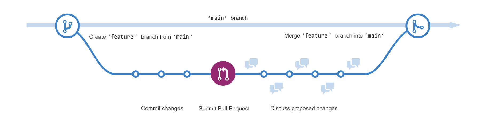

## What is Git?
Git is a version control system through command line that helps individuals or teams keep track of their code

The benefits of using Git:
- Keeps track of file changes.
- Multiple users can work on code as the same time through the use of branches.
- Enables you to label the “versions” of your code.
- Allows you to go back and restore previous versions.

## GitHub
Github is a platform that allows for the use of Git in a graphical user interace (GUI) format.

How does it work? 
- Github works through a system of organizing content into repositories, branches, folders, files, and media.

Each repository is a host of files that all center around a project, and will be where you include your files, media, and folders in regards to that project.

In the current Hackathon-2025 repository, you should start off with a README file, a LICENSE file, a codebase folder, and an assests folder
- The README file will have information about your project.
- the LICENSE file is the copyright information about the content your produce, including your code. This does not have to be changed.
- The codebase folder is where you will input your code.
- Your assests is where you will include any files that are not media include images, video, ect.

## Template Copy
 
The first thing you will want to do once you're signed in is click on the green button labeled "Use this Template" and "Create new Repository". Only one person in your group will need to do this.

The person who is creating the repository will choose themselves as the owner of the repository and what the repository will be called. Then when you're ready click on "Create Repository".

## Add Group Members

Once the repository is created, you will choose "Settings" in the top tool bar, then "Collaborators" in the lefthand toolbar. Under "Manage Access", add in the members of your group. You will want to figure out what level of permission each group member should have - you can choose to assign everyone at the "admin" level or give permissions that fits everyones role.

## Branching

Since you will be working on this project with others in your group, you will want to create a branching system.

Think of these as "alternative universes" to your main branch.

You will be able to make edits to the codebase simultaneously without creating any overlapping.

To create a branch, click on "Main" which stands for your main branch. You will then choose to "View all Branches".

You're then going to click on "New Branch" - after that give your branch a name and make sure you are copying it from the correct repository and from the main branch.

You will be able to tell you're working in the correct repository by seeing the name of your repository instead of main. This is also where you can go to switch between different repositories.

These changes will not appear on the main branch until you have a chance to push them.

## Create a file

You will want to click on the button marked "Add a File" then "Create a New File" or "Upload a File" - This is where you will add your file name and content before committing the file. Note: **To create a new folder, make sure to include /your-foldername/your-filename**

## Commit File

Once you add content, you will want to make sure to "Commit" your file - this takes a screenshot of what your repository looks like at that moment, which allows you to save your progress and go back to this moment in needed.

You will need to make sure to give your commit a description as a reminder of what changes you implemented during that commit. Make sure that you are committing back to the branch you're working on, unless you're trying to create a new branch for a complicated issue.

You should now be able to see your file amongst your other content.

## Pull request

This process will help to bring any changes that are made to your branch onto the main branch and vice versa

Go to the top toolbar where it says "Pull Requests", then click on the green button that says "New Pull Request".

From there, it will ask you as to which two branches you want to compare and then show you what changes exist between the two branches. If everything looks correct click on "Create Pull Request".

It will then ask you to include a title and description to keep track of which request this is. Once you finish, click on "Create Pull Request" again.

It will then bring you to a page which asks for someone to review the pull request before it's officially merged. You can have your coding partners give it a second opinion, or you can just go ahead and press "Merge Pull Request" and "Confirm Merge" if you don't need a second pair of eyes on it.

One thing to keep in mind is unfortunately you will not be able to see the changes others are making "live" to the files, so you need to remember to on occassional pull from the main branch to see changes your group members have made.

## Get Coding!

This is a basic introduction into Github - for more details, please visit docs.github.com look over their documentation.

